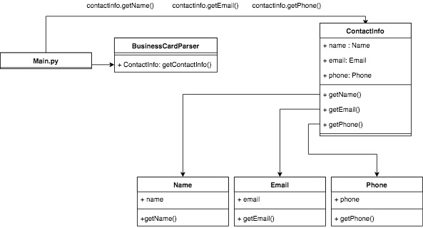

# Business Card Parser Project

This is my implementation of the Business Card Parser OCR for Asymmetrik. Although the Application was written with syntax specific to python3, it can also be run using python2. If the application is run with python2 it will generate .pyc files for all files that get compiled.

## Prerequisites

This application was designed to stay simple. By this I mean I decided to stay away from modules that are not included in the standard python library. The only thing the user will need is python installed on their system.

## Running the Application

### Python3

Navigate to the directory where the application resides, and run the following command: 
```
python3 main.py <absolute or relative path to the contact text file>
```
EX:
```
python3 main.py contacts/card3.txt
```

### Layout
This diagram is not an official UML diagram, rather just an image to get a sense of how the program operates. Main.py calls businesscardparser to get a contactinfo object. The contactinfo object forwards the calls to getName, getPhone, and getEmail to their respective classes. Arrows are used to represent how methods are called.



